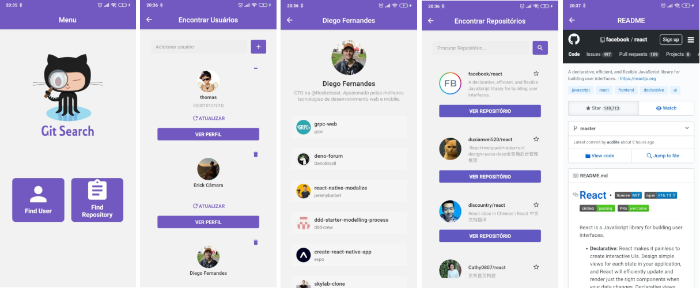

<!--  -->
<div id="teste">
    
    <h1 align="center">Git Search App <h1>
</div>

<h3 align="center">Pesquise usuários, repositórios e adicione a sua lista</h3>

<p align="center">
  <a href="https://drive.google.com/file/d/1rbdADrFLHxBktDZAPfJ0JFQhPaWMYsNG/view?usp=sharing">
    
  </a>
</p>





Git Search é um aplicativo feito em React Native, utilizando a API do GitHub.

Tem o intuito de realizar consultas de usuários e principalmente de repositórios do GitHub, possuindo a possibilidade de adicionar os mesmos em uma lista de favoritos, de forma a facilitar o acesso

## Iniciando

Instale as dependências necessárias:

```bash
yarn install
```

Em seguida abra o seu emulador ou conecte o seu celular ao computador e em seguida execute:

```bash
yarn android
```

No seu celular ou emulador aparecerá um Pop-up solicitando para instalar o aplicativo. Clique em instalar. Após realizar a instalação o aplicativo será aberto, porém só aparecerá uma tela preta com uma mensagem informando que não conseguiu carregar o app.

Agora para colocar o aplicativo para rodar basta executar:

```bash
yarn start
```

E o seu aplicativo será carregado normalmente. Caso não seja, basta fechar o app e abrir novamente.

## Observação

Caso ocorra algum erro ao executar o aplicativo, informando que está faltando alguma dependência, basta verificar o arquivo `package.json` que será possível ver todas as dependências necessárias para rodar o programa.


<style type="text/css">
#teste {
  display: inline;
  margin-left: auto;
  margin-right: auto;
}
</style>
